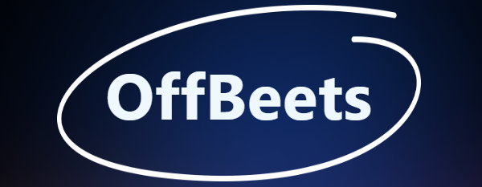

# OffBeets 🚫🎶

**OffBeets** is a web application that takes in your favorite song and uses Spotify's Web API to anti-recommend 4 least similar songs and 4 most similar songs. The best comes unexpected 🎧💫

## 🌟 Features

🎵 Input a song name from Spotify

🔀 Anti-Recommendations: Get four songs that are **least similar** based on your input

💖 Recommendations: Get four songs that are **most similar** to your input

🌐 Discover and share new music with your friends!

## 🚀 Getting Started

Follow the instructions in our [setup](https://github.com/MarleaM/OffBeets/blob/484ba0c29a766bf823fbb6bdaec3b3e47feaaa38/resources/documentation/setup.md) file to set up and run OffBeets on your local machine for development and testing purposes.

## 🎬 Usage
1. Run the frontend and backend scripts as detailed in our [setup](https://github.com/MarleaM/OffBeets/blob/484ba0c29a766bf823fbb6bdaec3b3e47feaaa38/resources/documentation/setup.md) file
2. Open the web app in your browser by visiting http://localhost:5173 (or port 5174, 5175)
3. Enter a song name in the search bar and press Search
4. Wait and view your results

## 🤝 Contributing
We'd love your contributions! Please check out our [Contributing Guidelines](https://github.com/MarleaM/OffBeets/blob/484ba0c29a766bf823fbb6bdaec3b3e47feaaa38/resources/documentation/contributing.md) for tips on getting started.

## 📜 License
This project is open-source and available under the MIT License.

## 🙏 Acknowledgments
Thanks to Spotify for providing a great API for music metadata!

Inspired by alternative ways to discover music through our similarities and differences...

Co-founded with love by Marlea, Lisa, Tony, and Emily. ❤️

# Happy Listening! 🎶✨
